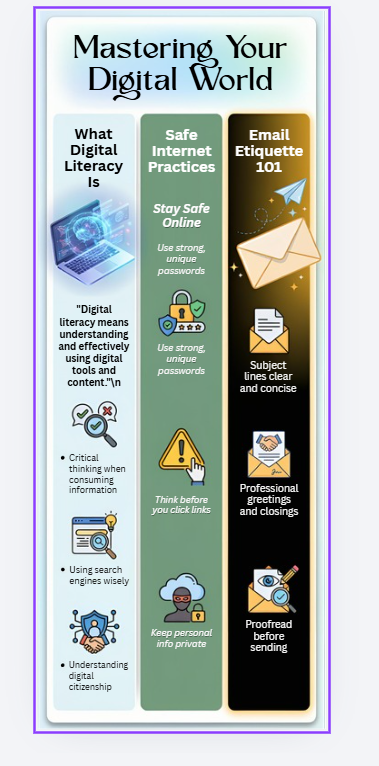
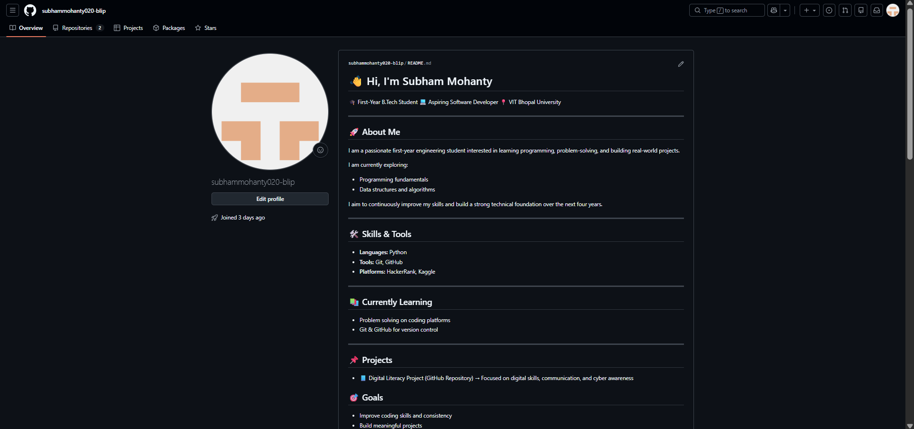
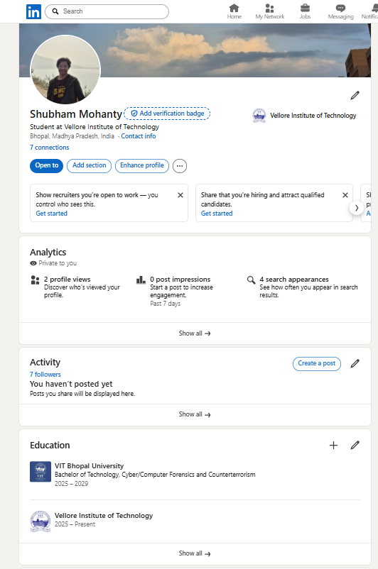
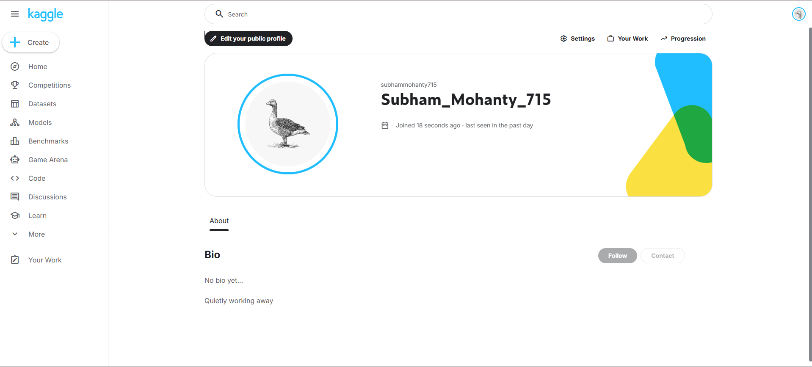

# Digital-Literacy-Project

* **Name:** Subham Mohanty
* **Registration Number:** 25BCY10060
* **Course Code:** CSE0001
* **Course Title:** Digital Literacy

---

## 📌 Project Overview

This repository contains my Digital Literacy Project, completed as part of the CSE0001 course at VIT Bhopal University.

The objective of this project is to develop essential digital competencies required in today’s academic and professional environment. These include creating a professional online presence, understanding digital communication etiquette, using collaborative tools, practicing coding skills, and gaining awareness about cyber threats.

The project is divided into five structured tasks, each focusing on a different aspect of digital literacy. All relevant files, screenshots, and documentation are included in this repository.

---

## 🎯 Objectives of the Project

* To understand the concept and importance of digital literacy
* To build a professional digital identity using online platforms
* To explore coding and collaboration tools used in academics
* To learn proper email etiquette and responsible communication
* To develop awareness about cybercrime and online safety

---

## 📂 Repository Structure

```id="w6f0tr"
Digital-Literacy-Project/
│
├── Task-1/
│   └── Infographic (Canva)
│
├── Task-2/
│   └── Profile screenshots (GitHub, LinkedIn, Kaggle)
│
├── Task-3/
│   ├── hacker_rank_1.png
│   ├── hacker_rank_2.png
│   ├── google_form.png
│   ├── google_responses.png
│ 
│
├── task-4-email-etiquette/
│   ├── Email.md
│   └── social-media-checklist.md
│
├── task-5-cybercrime/
│   ├── casestudy.md
│   └── prevention-checklist.md
│
├── report/
│   └── project_report.pdf
│
└── README.md
```

---

### ✅ Task 1 – Digital Literacy Awareness Infographic

In this task, I created an infographic using Canva to explain key concepts of digital literacy. The infographic covers:

* Definition of digital literacy
* Safe internet practices
* Importance of a professional online presence

This task improved my ability to present information visually and concisely.




---

### ✅ Task 2 – Student Digital Portfolio

In this task, I created and updated my profiles on professional platforms:

* **GitHub** – for managing and showcasing projects
 


* **LinkedIn** – for building a professional network\

 

* **Kaggle** – for exploring datasets, practicing data science, and participating in competitions


Kaggle provides access to real-world datasets and notebooks, which will help me develop data analysis and machine learning skills in the future.

These platforms will be very useful throughout my academic journey for building skills, showcasing work, and exploring opportunities.




---

### ✅ Task 3 – Coding & Collaboration Platforms

This task involved both coding practice and collaboration tools:

**🔹 Coding Practice:**

* Platform Used: HackerRank
* Completed a beginner-level problem
* Learned basic problem-solving and logical thinking

**🔹 Collaboration Tool:**

* Created a Digital Literacy Quiz using Google Forms
* Included 5 questions (MCQ + short answer)
* Responses are automatically stored in Google Sheets

🔗 **Google Form Link:**
[Click here to access the quiz](https://docs.google.com/forms/d/e/1FAIpQLScxiH5pKCyd-TTk049BBfzpMyWVo4aW8OzYvfCLmfxvJyLabQ/viewform?usp=dialog)

This task helped me understand how digital tools can be used for learning and data collection.

---

### ✅ Task 4 – Email Etiquette & Social Media Responsibility

In this task, I:

* Drafted two professional emails:

  * Request for assignment extension
  * Internship inquiry
  * [click to access both the emails](task-4-email-etiquette/Email.md)
    
* Created a checklist of Social Media Do’s and Don’ts

This task enhanced my understanding of formal communication and responsible online behavior.
[click to access checklist](task-4-email-etiquette/social-media-checklist.md)

---

### ✅ Task 5 – Cybercrime Awareness

This task focused on understanding cyber threats:

* Created a case study on **UPI Fraud**
* Explained how scams occur and their consequences
* Developed a prevention checklist with actionable tips

This task increased my awareness of online risks and safety measures.

---

## 🧠 Learning Outcomes

Through this project, I gained:

* Knowledge of digital literacy concepts
* Practical experience with online tools and platforms
* Improved professional communication skills
* Awareness of cyber threats and prevention techniques
* Understanding of data platforms like Kaggle

---

## 🛠️ Tools & Platforms Used

* Canva (Infographic Design)
* GitHub (Project Repository)
* LinkedIn (Professional Profile)
* Kaggle (Data Science Platform)
* HackerRank (Coding Practice)
* Google Forms & Google Sheets (Collaboration & Data Collection)

---

## 📢 Key Takeaways

* Digital literacy is essential for academic and professional success
* A strong online presence helps in career growth
* Coding and data platforms improve technical skills
* Clear communication is crucial in digital environments
* Cybersecurity awareness is necessary to avoid online threats

---

## 📎 Conclusion

This project provided a comprehensive understanding of digital tools, communication practices, and cybersecurity. It helped me develop essential skills that will be useful throughout my academic journey and future career.

Overall, this project has made me more confident, responsible, and aware as a digital citizen.

---

## 📚 References

* https://www.canva.com
* https://github.com
* https://linkedin.com
* https://kaggle.com
* https://hackerrank.com
* https://forms.google.com
* https://cybercrime.gov.in

---
